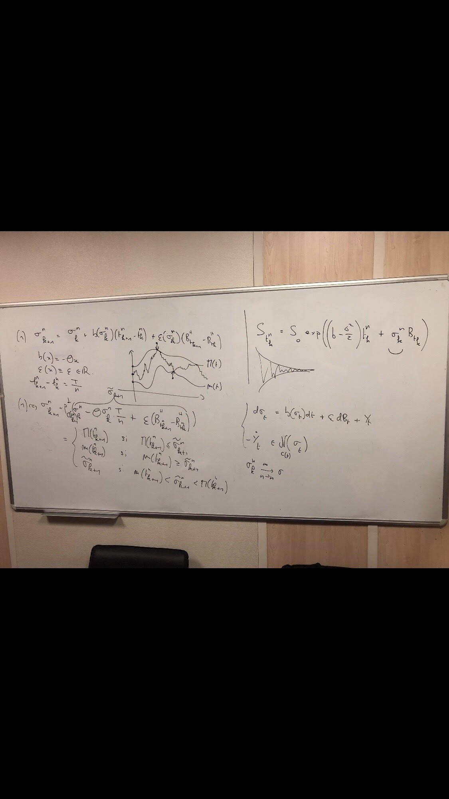

# Model_Moreau_Skorokhod
Creation d'un model que j'ai appelé MOREAU_SKOROKHOD
Volatilité Contrainte, Processus de rafle de Moreau, Problème de Skorokhod.

Estimation de la tendance d’un problème de réflexion de Skorokhod associé à une équation différentielle dirigée par le mouvement brownien fractionnaire et à un processus de rafle de Moreau avec application en finance.
 ©Junholv OBO

